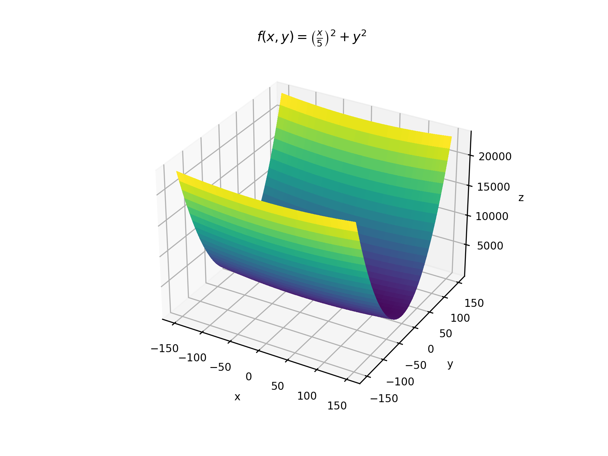
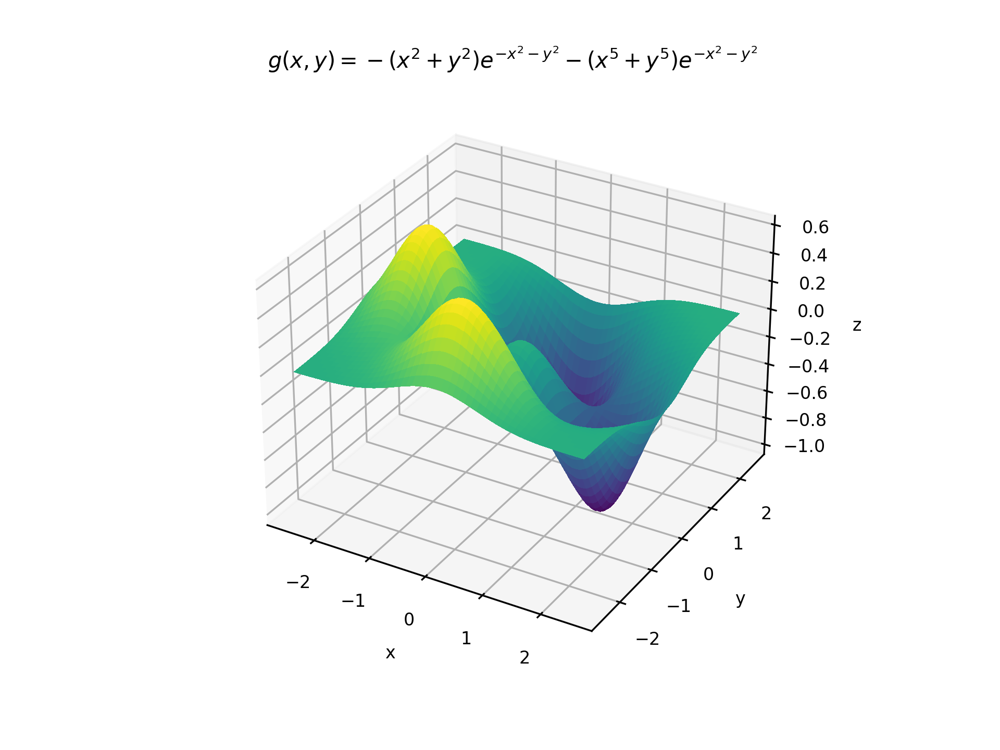
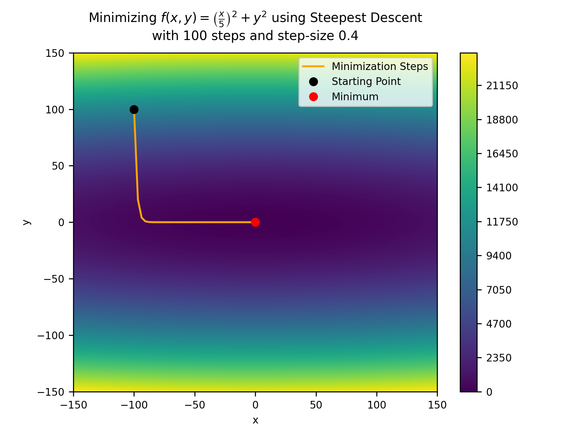
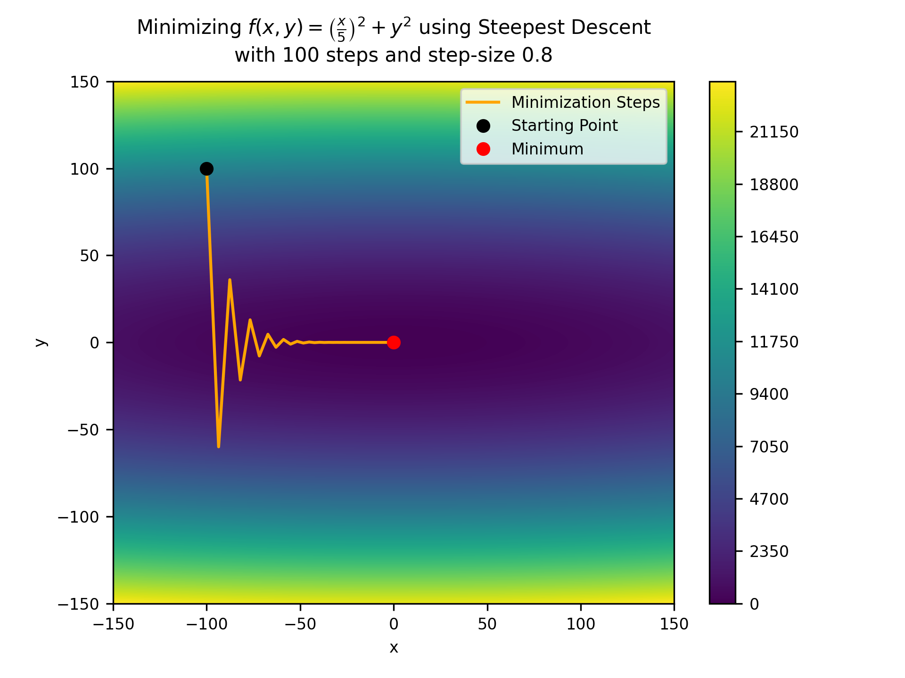
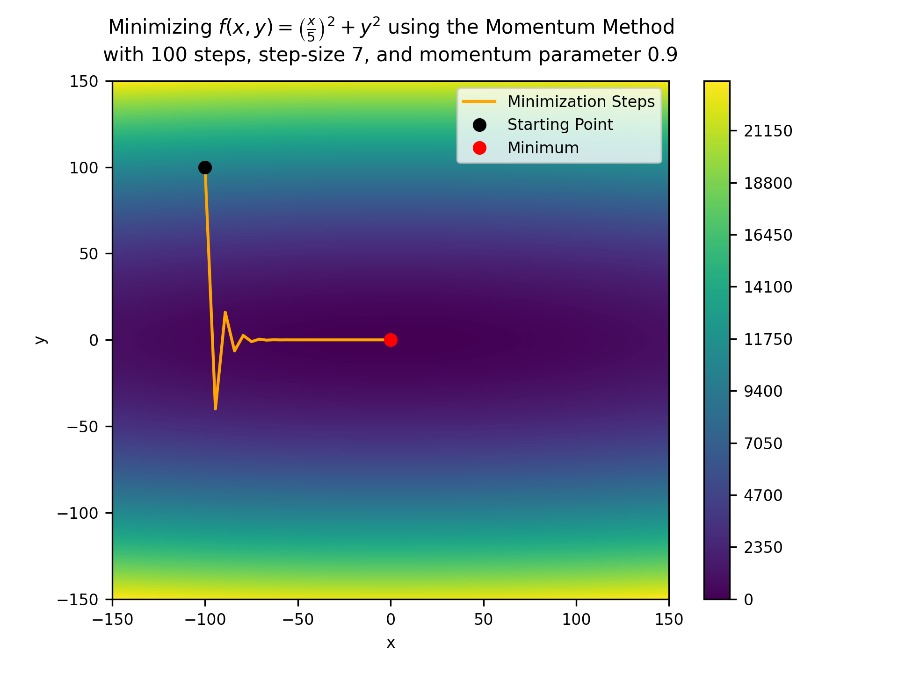
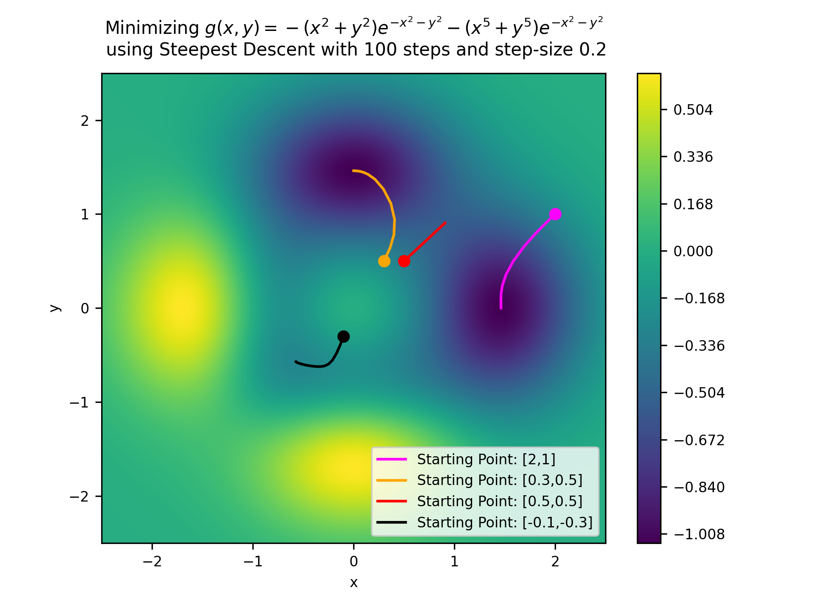
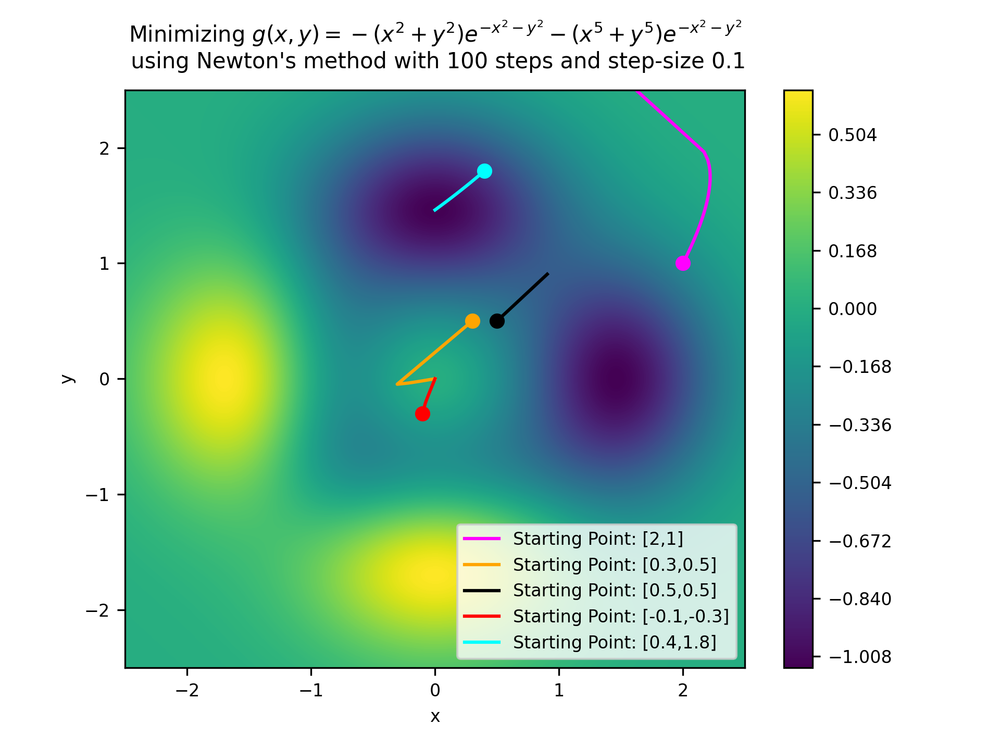

# Visualization-of-Gradient-Descent

This is a personal investigation into the efficiency and accuracy of different gradient descent algorithms. Three algorithms were tested: [Steepest Descent](https://en.wikipedia.org/wiki/Gradient_descent), [Newton's Method](https://en.wikipedia.org/wiki/Newton%27s_method_in_optimization), and the [Momentum Method](https://en.wikipedia.org/wiki/Stochastic_gradient_descent#Momentum). The algorithms were tested on the following functions:

 
## Results

