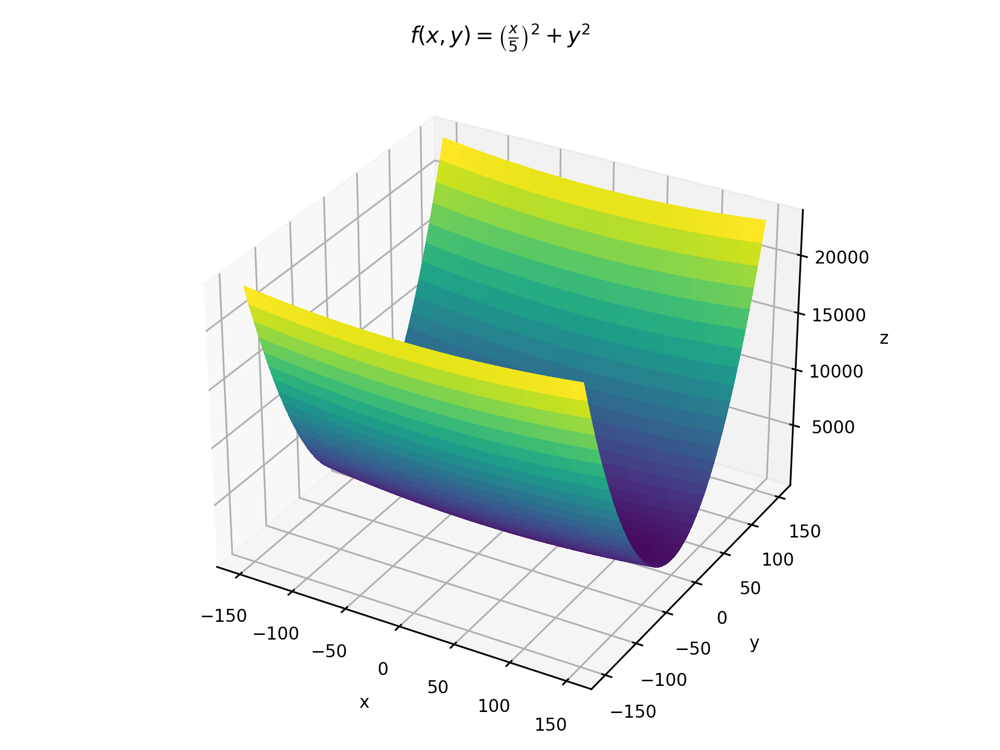
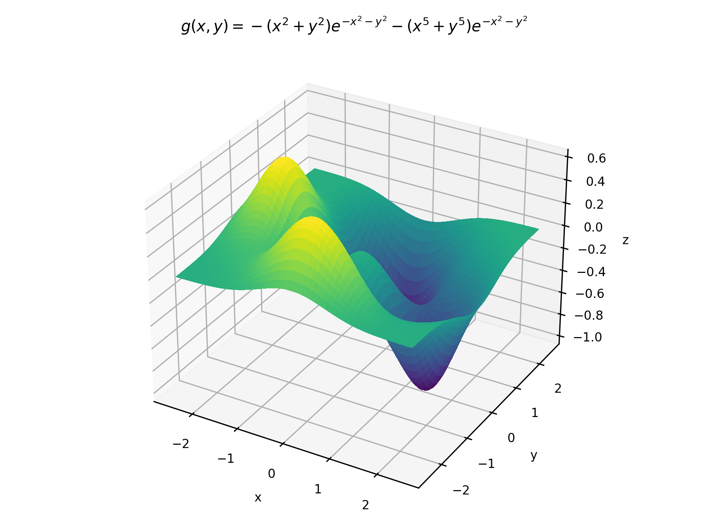

# Visualization-of-Gradient-Descent

This is a personal investigation into the efficiency and accuracy of different gradient descent algorithms. Three algorithms were tested: Steepest Descent, Newton's Method, and the Momentum Method. The algorithms were tested on the following functions:

 
## Results

